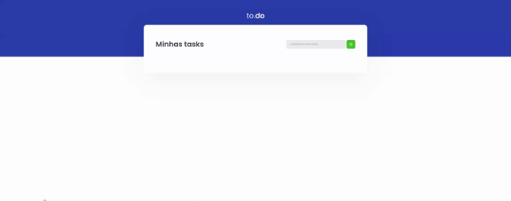

<h3 align="center">
  Challenge 1: ReactJS Concepts
</h3>

  
  
  
  

  <a href="#rocket-about-the-challenge">About the Challenge</a>&nbsp;&nbsp;&nbsp;|&nbsp;&nbsp;&nbsp;
  <a href="#technologies">Technologies</a>&nbsp;&nbsp;&nbsp;|&nbsp;&nbsp;&nbsp;
  <a href="#installation">Installation</a>&nbsp;&nbsp;&nbsp;|&nbsp;&nbsp;&nbsp;
  <a href="#memo-license">License</a>

 

---

## :rocket: About the Challenge

Challenge consists of a small application of activities to do, to train a little more about state manipulation in React.

- Add a new task
- Remove a task
- Mark and unmark a task as completed

## Technologies

- [ReactJS](https://reactjs.com/)
- [Typescript](https://www.typescriptlang.org/)
- [Webpack](https://webpack.js.org/)

## Installation

1. Clone the repository: `git@github.com:matheus-neves/ignite-reactjs-challenge-concepts.git`
2. Access the directory: `cd ignite-reactjs-challenge-concepts`
3. Install the dependencies: `yarn`
5. Run the app: `yarn dev`
6. Run tests: `yarn test`

## :memo: License

This challenge is under license from MIT. See the archive [LICENSE](https://github.com/matheus-neves/ignite-reactjs-challenge-concepts/LICENSE.md) for more details.

---

Challenge completed :heavy_check_mark:

Made with 💜 &nbsp; by Matheus Neves [See my linkedin!](https://www.linkedin.com/in/matheus-neves-front-end/) :wave:
